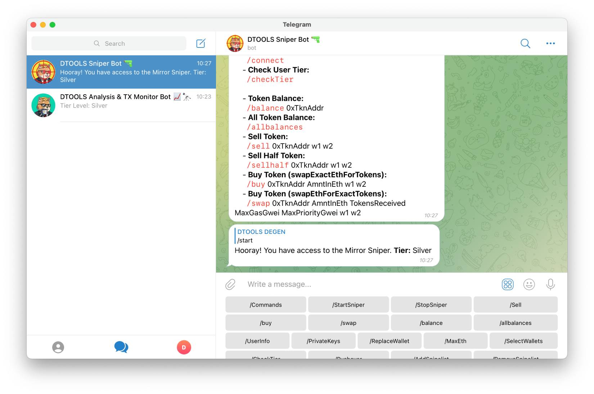
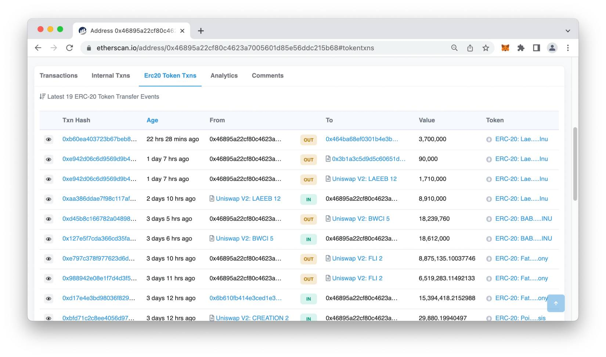
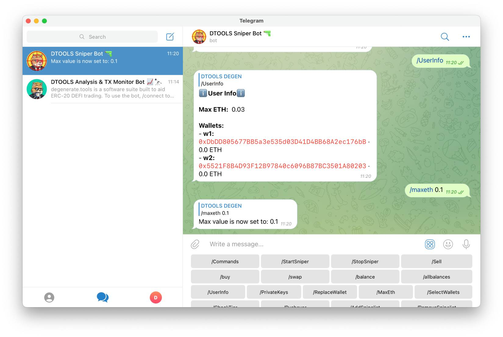
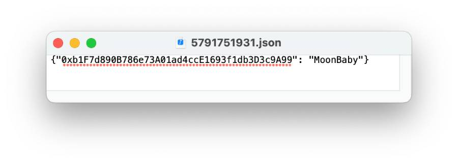
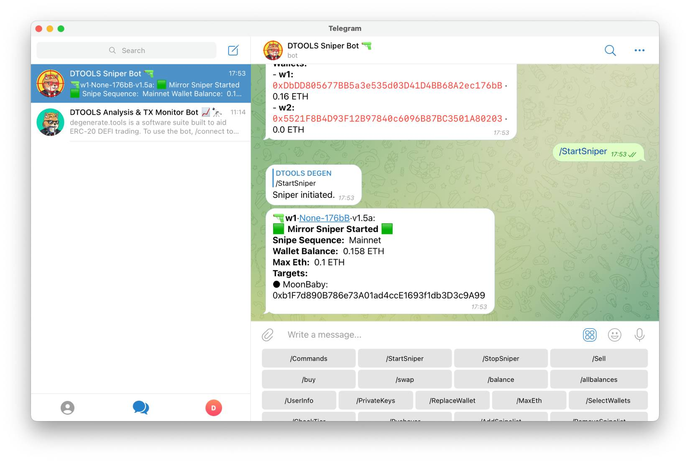

# How to Use DTOOLS Sniper Bot

## Step 1 - Connect to the Mirror Sniper bot.

> If you haven't already setup DTOOLS yet and connected your wallet before, make sure to follow the [How to Setup DTOOLS](PLACE-URL) tutorial before proceeding.

Open the [DTOOLS Sniper Bot](https://t.me/DegenerateToolsSniper_bot) and click the button '**`/Start`**' to begin.

A list of available commands will appear and provided you are connected properly, you will receive a message "Hooray! You have access to the Mirror Sniper." with your tier level.

Call the function '**`/CheckTier`**' to make sure you are connected. Your tier level should display. 

If not, connect your wallet again by calling the '**`/Connect`**' function and following the same steps as shown in the [How to Setup DTOOLS Tutorial](PLACE-URL).

## Step 2 - Research

The research needed in order to find quality snipers is often overlooked as people are eager to use the Mirror Snipe. It's worth stressing here that it is very important to take your time in this and consistently work on it for a while before running the sniper.

This is hardest part for users to master, but once this step is mastered, you should have no problem printing Ether with the DTOOLS Mirror Sniper.

There is a lot involved in this step as there are many tools to use and approaches to take, but here below we'll offer a rough guideline.

For the Bronze tier you can follow these steps, otherwise if you have Silver or Gold, you can even include using extra tools as part of your workflow that Silver and Gold gives you access to, like the '**`/SnipeAnalysis`**' and '**`/FindSnipers`**' functions in the [DTOOLS Analysis & TX Monitor Bot](https://t.me/DegenerateTools_Bot).

### 2.1 - Investigate New Token Launches

Explore the first **30 buys** of successful token launches each day.

Go through all the first pages of transactions using [Etherscan](https://etherscan.io/) to search with the contract address of the token you are investigating, then on the '**transfers**' tab selecting '**Txn Hash**' to view the transaction. From there, you can start to explore wallet addresses.

Do this often and do this regularly to catch wallets making good trades on successful token launches.

### 2.2 - Analyze Individual Wallet Histories

Wallets you are looking for generally don't trade a lot in one day, but when they do, they don't usually get rugged as they make sure to ape into coins they are sure will do well. 

It's recommended to go back at least one month in through their transactions to analyze their profit and loss. Use Etherscan to manually go through the wallet history, and/or other tools.

>  **Tip**: click the '**Erc20 Token Txns**' tab to see what they’ve sniped. 

### 2.3 - Track Wallets and Take Notes

Track wallets over days and weeks even, to monitor in real time the activity of your sniper watchlist and determine if they are truly profitable snipers to copytrade with using the DTOOLS Mirror Sniper.

Being able to identify selective, profitable wallets that get in early and avoid rugs is crucial in your own success as a trader. 

The motto goes: 
> "You are as good as the sniper you are copytrading."

Research is a constant process which requires consistency. It's best to find what works for you that gives you results and hone in by making it more efficient. It's important to keep updating your watchlist and remove wallets that don't perform well. 

In general, the advice from the developer and community is that, there are usually between 1 and 3 good launches per day, which means, after you have put in the research of finding snipers to copytrade with, your Mirror Sniper should only enter 1-3 trades per day. Therefore it's important to be selective from whom you start sniping with using the DTOOLS Mirror Sniper Bot.

Remember to ask the community for extra tips and tricks via the public [DTOOLS Telegram Chat](https://t.me/degeneratetools) and for Silver or Gold Tier members, the [DTOOLS Degen Secret Society Telegram Chat](https://telegram.me/collablandbot?start=VFBDI1RFTCNDT01NIy0xMDAxNjc5MTkyMjI4). 

Both chats are full of long term snipers who can help with any questions or queries. They'll happily point you in the right direction and even share with you their own unique workflows.

## Step 3 - Configure Sniper Bot 

Before running the Sniper Bot, we need to configure the bot by funding it with Ether, setting the max ETH spend and add wallet addresses to the Snipelist.

### 3.1 - Set Max ETH

Call the user info function by typing '**`/UserInfo`**'. Here you will see your '**Max ETH**' and '**Wallets**' with your wallet addresses below.

Set your Max ETH spend by typing '**`/MaxEth 0.1`**' for example to set your Max Eth spend to 0.1 ETH. This means that only your copytrade transactions which spend less than 0.1 ETH including gas fees will go through.

### 3.2 - Fund Sniper Wallet

Now you need to fund your sniper wallet with Ether to start trading. 

Select the wallet address under your wallet listed to automatically copy it to your clipboard. Use this wallet address with MetaMask or on an exchange to deposit Ether.

Once your ETH has been transferred, check back on [DTOOLS Sniper Bot](https://t.me/DegenerateToolsSniper_bot) to see your new wallet balance, calling the '**`UserInfo`**' function again.

> Note, to run the Sniper Bot you need to always have a minimum balance of 0.15 ETH in your wallet.

### 3.3 - Add Wallets to Snipelist

All that's left is to add wallets to your Snipelist and start the sniper.

The '**`AddSnipelist`**' and '**`RemoveSnipelist`**' functions are for adding and removing wallet address to your snipelist. 

The Sniper Bot monitors snipes from this list of wallets by filtering through their live transactions. The bot then initiates copytrades using the wallet you have just funded with ETH.

Message the Sniper Bot '**`/AddsSipelist MoonBaby 0xWalletAddress`**' for example to add this wallet address to your Snipelist with the label 'MoonBaby'.

To remove it, simply message: '**`/RemoveSnipelist 0xWalletAddress`**'.

The bot will message back "Snipelist address book has been updated." with a .json file to download. View this in a text edit application to view the current Snipelist.

When you notice a sniper is trading from multiple wallets, you can give them the same name and they will appear within the same sub-group on your Snipe List.

## Step 4 - Inititate Sniper

Use the '**`/UserInfo`**' function to double check you have enough Ether in your wallet and that your MaxETH spend isn't too high before activating the Sniper Bot.

If everything is ready and you are confident in your tracked wallet's ability to make good profitable trades, activate the Sniper Bot.

Initiate the Sniper Bot by typing '**`/StartSniper`**'.

> Note: The Sniper Bot needs to be manually restarted after a snipe has happened. So make sure to type '**`/StartSniper`**' if you want to continue sniping, even after a successful snipe has gone through. Likewise with manual transactions done via UniSwap.

When you don't want to be sniping with the bot, simply use the command '**`/StopSniper`**' to stop the bot from running.

## Step 5 - Take Profit
In order to take profit or exit positions, speed is sometimes really important, which is why DTOOLS offers two Fast Sell functions to use within Telegram.

### 100% Slippage Fast Sell Function

The most important and used function is the 100% Slippage Fast Sell function, in which you sell 100% of the token you copytraded for the price it is worth at that moment at a click of a button.

To use it simply message the Sniper Bot: '**`/Sell 0xTokenAddress w1`**'

### Sell Half Function

If you still want to keep a position open and take profits incrementally, there is also the Sell Half function.

Simply message the Sniper Bot: '**`/SellHalf 0xTknAddress w1`**'

If you require to sell different amounts, it's recommended that you manually make Multicall trades using Uniswap for example.

## Other Functions

### Private Key
Use this function to obtain the Private Key for a wallet address you have been using within the DTOOLS Sniper Bot. It's important for transferring profits out to your other wallets or an exchange. 

Call the function '**`/PrivateKeys`**' to see a list of your private keys for each wallet. Click the Private Key to copy it to your clipboard, then paste this into MetaMask Import Wallet function to control it.

### Replace Wallet
You can replace a wallet address with a brand new one that is not connected to the original. This may be useful when you notice other people copying your trades.

Message the Sniper Bot '**`/ReplaceWallet w3`**' for example to replace your third wallet (w3).

### Pushover Key
[Pushover](https://pushover.net/) is a great service to articulate notifications with different apps or services. With this function DTOOLS gives you the opportunity to get direct notifications sent your devices, separate from Telegram itself.

Add your pushover user key to the Sniper Bot to setup notifications. 

Message the Sniper Bot: '**`/Pushover YourUserKey`**'

### Token Balance
This function gives you the ability to view your token balance for a particular token in ETH:
      
Message the Sniper Bot '**`/Balance 0xTknAddress`**'

### All Token Balances 
This function gives you the ability to view all your token balances in ETH, in a list form.

Message the Sniper Bot '**`/AllBalances`**'